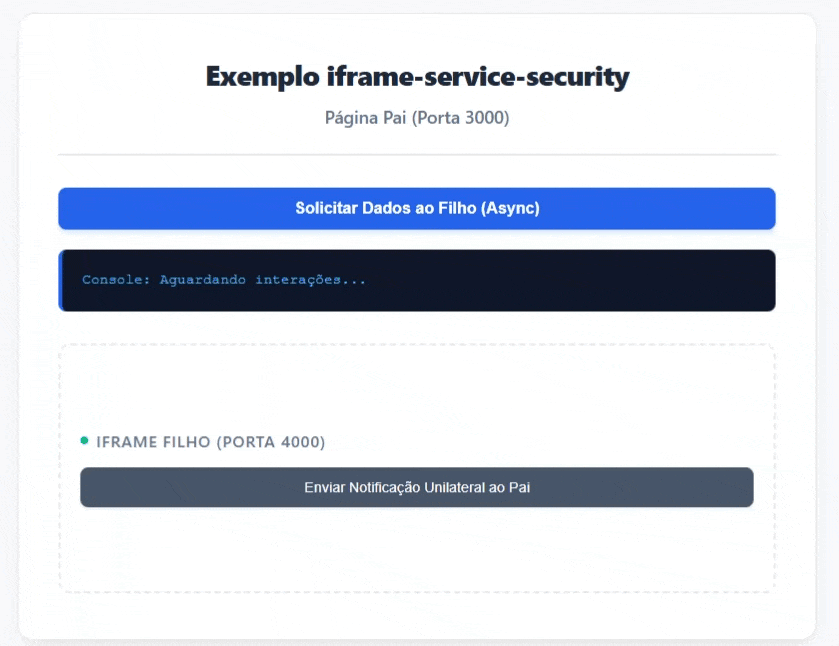

# IframeServiceSecurity 🔒

Uma solução leve, agnóstica e de alta segurança para comunicação bidirecional e assíncrona entre aplicações **Pai (Host)** e **Iframes Filhos (Embedded)** rodando em diferentes portas ou domínios (`Cross-Origin`).



## 💡 A Proposta
Mecanismos tradicionais baseados puramente em `window.postMessage` sofrem com vulnerabilidades de interceptação por scripts terceiros e complexidade de concorrência assíncrona. 

`IframeServiceSecurity` resolve isso combinando camadas de proteção de nível corporativo:
1. **Isolamento de Processo Nativo:** Utiliza `MessageChannel` (`port1` e `port2`) transferindo a propriedade de memória da conexão. Nenhuma outra extensão ou script global consegue interceptar as mensagens.
2. **Protocolo Requisição-Resposta Assíncrono:** Mapeamento de callbacks via **Nonces (UUIDs únicos)**. Permite o uso nativo de `async/await` e impede ataques de Replay.
3. **Constantes Fortemente Tipadas:** Centralização do catálogo de mensagens em constantes estáticas internas, mitigando falhas humanas por digitação.

---

## 🛠️ Configuração de Segurança de Infraestrutura Obrigatória

Para suportar o isolamento máximo do navegador contra ataques, certifique-se de configurar os seguintes cabeçalhos HTTP no seu ecossistema:

### No Servidor do Iframe Filho (Porta 4000)
```javascript
res.setHeader("Content-Security-Policy", "frame-ancestors 'self' http://localhost:3000 http://127.0.0.1:3000");
-- Define quem tem permissão para colocar esta página dentro de um <iframe>. Bloqueia ataques de Clickjacking. 

res.setHeader("Cross-Origin-Resource-Policy", "cross-origin"); // OBRIGATÓRIO para o MessageChannel cross-origin
-- Serve apenas para evitar que o navegador bloqueie o iframe via CORB (Cross-Origin Read Blocking)

res.setHeader("X-Content-Type-Options", "nosniff");
--  Obriga o navegador a seguir estritamente o Content-Type enviado pelo servidor, prevenindo ataques de injeção de scripts (XSS).
```

### Na Tag HTML do Iframe (Porta 3000)
O atributo `sandbox` **deve** incluir `allow-same-origin` para permitir que o navegador valide os cabeçalhos de isolamento do servidor.
```html
<iframe id="meuIframe" src="http://127.0.0.1:4000" sandbox="allow-scripts allow-same-origin"></iframe>
```

---

## 💻 Como Usar

### Testar localmente, sem instalar via NPM

Execute: npm install e depois: npm run examples;

### 1. Na Aplicação Pai (Host - Porta 3000)
Instancie o serviço apontando para o elemento do iframe. Use o método `requisitar` para disparar ações que esperam um retorno assíncrono, e forneça o `onNotification` para capturar eventos empurrados pelo filho de forma espontânea.

```javascript
const IframeServiceSecurity = require('iframe-service-security');

const comunicadorPai = IframeServiceSecurity.criarInstanciaPai({
    iframeElement: document.getElementById('meuIframe'),
    urlIframeFilho: 'http://localhost:4000',
    timeoutHandshakeMs: 3000,
    timeoutRequisicaoMs: 8000,
    onNotification: (acao, payload) => {
        objResultado.className = ""; // limpa estados de erro/sucesso antigos
        objResultado.innerText = `[Notificação Espontânea]\nAção: ${acao}\nPayload: ${JSON.stringify(payload, null, 2)}`;
    }
});

// Exemplo de requisiç1ão assíncrona usando async/await
async function enviarPedido() {
    objResultado.className = "";
    objResultado.innerText = "Aguardando resposta do filho...";

    try {
        const resposta = await comunicadorPai.requisitar('obterPerfil', { id: 7 });
        objResultado.classList.add("sucesso");
        objResultado.innerText = `[Resposta Assíncrona Recebida]:\n${JSON.stringify(resposta, null, 2)}`;
    } catch (erro) {
        objResultado.classList.add("erro");
        objResultado.innerText = `[Erro]: ${erro.message}`;
    }
}
```

### 2. No Iframe Filho (Embedded - Porta 4000)
Defina a lista de origens confiáveis e configure a função `onReceiveRequest` para processar e responder às requisições do pai. Use o método `notificarPai` para enviar dados voluntários a qualquer momento.

```javascript
const IframeServiceSecurity = require('iframe-service-security');

const comunicadorFilho = IframeServiceSecurity.criarInstanciaFilho({
    origensPermitidas: ['http://localhost:3000', 'http://127.0.0.1:3000'],
    
    // Processa e responde requisições do Pai
    onReceiveRequest: async (acao, payload) => {
        if (acao === 'obterPerfil') {
            await new Promise(r => setTimeout(r, 500));
            return { nome: "Renan CCN", id: payload.id };
        }
        throw new Error("Ação não suportada");
    }
});

// Exemplo de notificação ativa do filho para o pai (Sem requisição prévia)
function notificarPaiVoluntariamente() {
    comunicadorFilho.notificarPai('Notificação do filho', { status: 'sucesso' });
}
```

## 📄 Licença
Este projeto está sob a licença MIT.
